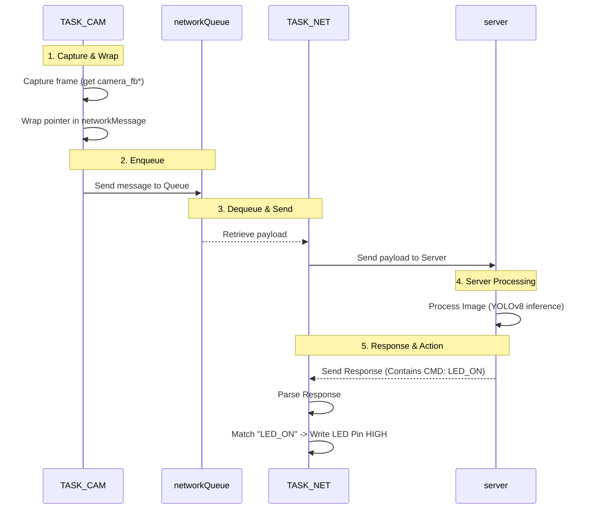

# Architecture

### Server-Firmware Interaction Diagram

```mermaid
sequenceDiagram
    participant TASK_CAM
    participant networkQueue
    participant TASK_NET
    participant server

    Note over TASK_CAM: 1. Capture & Wrap
    TASK_CAM->>TASK_CAM: Capture frame (get camera_fb*)
    TASK_CAM->>TASK_CAM: Wrap pointer in networkMessage
    
    Note over TASK_CAM, networkQueue: 2. Enqueue
    TASK_CAM->>networkQueue: Send message to Queue
    
    Note over networkQueue, TASK_NET: 3. Dequeue & Send
    networkQueue-->>TASK_NET: Retrieve payload
    TASK_NET->>server: Send payload to Server
    
    Note over server: 4. Server Processing
    server->>server: Process Image (YOLOv8 inference)
    
    Note over server, TASK_NET: 5. Response & Action
    server-->>TASK_NET: Send Response (Contains CMD: LED_ON)
    TASK_NET->>TASK_NET: Parse Response
    TASK_NET->>TASK_NET: Match "LED_ON" -> Write LED Pin HIGH
```