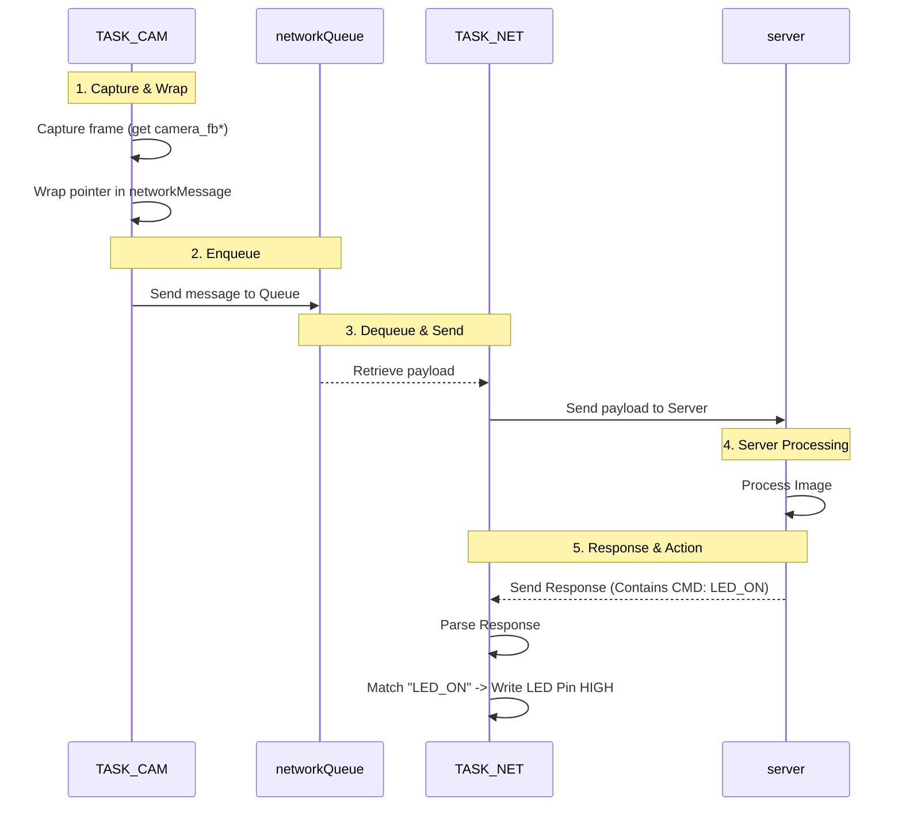

# Firmware Implementation

designed to run in resource-constrained outdoor environments.

### System Design Goals

1. Consistent capture high quality images from the camera module for each 5 second - 1 minute interval
2. Transmit small pockets of data, since the device is mainly stored outside in the box and may not have a good WiFi connection
3. In the real setting, it would need to be powered by a small commercial battery pack, so power efficiency is important, but for the prototype we focused on functionality first, powered by the USB cable.
4. Able to be remotely controlled.

### Firmware Diagram



### Firmware Architecture

Since this esp32 has dual cores, we assigned the high priority camera capture task to Core 1, while the network transmission task runs on Core 0.

They will be communicated via a **FreeRTOS** Queue in a producer-consumer pattern. The camera task (producer) captures images and places pointers to the image buffers into the queue. The network task (consumer) retrieves these pointers from the queue and send the HTTP request. This ensures there is zero data copying between tasks, [optimizing both memory usage and CPU cycles](memory-optimization.md).

```C
void Task_Camera(void *pvParameters) {
  ...
  camera_fb_t *fb = esp_camera_fb_get();
  ...
  NetworkMessage msg = createImageUploadMessage(fb);
  if (xQueueSend(networkQueue, &msg, pdMS_TO_TICKS(NETWORK_QUEUE_MAX_WAIT_MS)) != pdTRUE) {
    esp_camera_fb_return(fb); // Return the frame buffer if not sent
  }
  ...
}

void Task_Network(void *pvParameters) {
  ...
  if (xQueueReceive(networkQueue, &msg, portMAX_DELAY) == pdTRUE) {
    uploadImage(msg.fb);
    esp_camera_fb_return(msg.fb); 
  }
  ...
}
```

### Stateless Command Protocol ("HTTP Piggybacking")

To minimize the memory usage and power consumption, I actually did not use the MQTT callback mechanism. Instead, when the server acknowledges an image (200 OK), it sends commands (e.g., BLINK;REBOOT) in the response body.

We don't actually need a real time control, so this simple request-response model works well.

```C
handleHTTPResponse() {
  String payload = http.getString(); // Example: "BLINK;REBOOT;REPORT"
  ...
}
```

### Command Parsing Pipeline

Multiple Commands maybe sent in one response, delimited by semicolons. The command parser splits the string and executes them sequentially.

