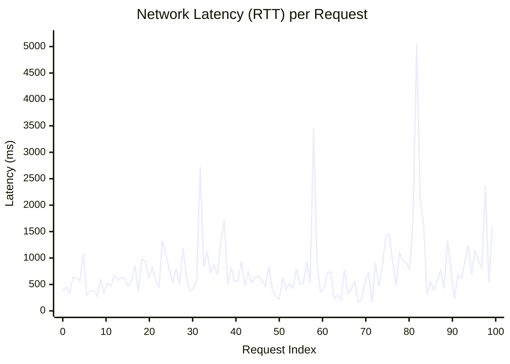
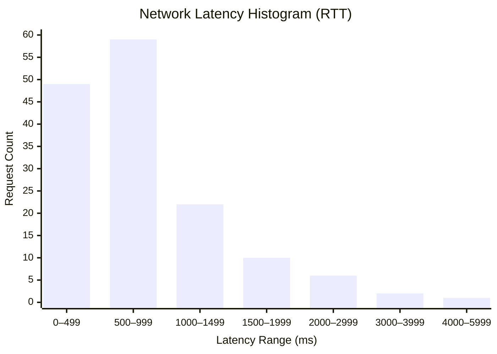
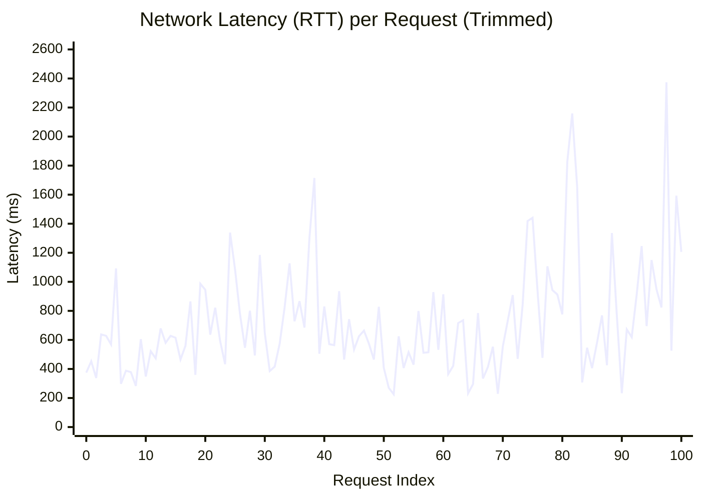
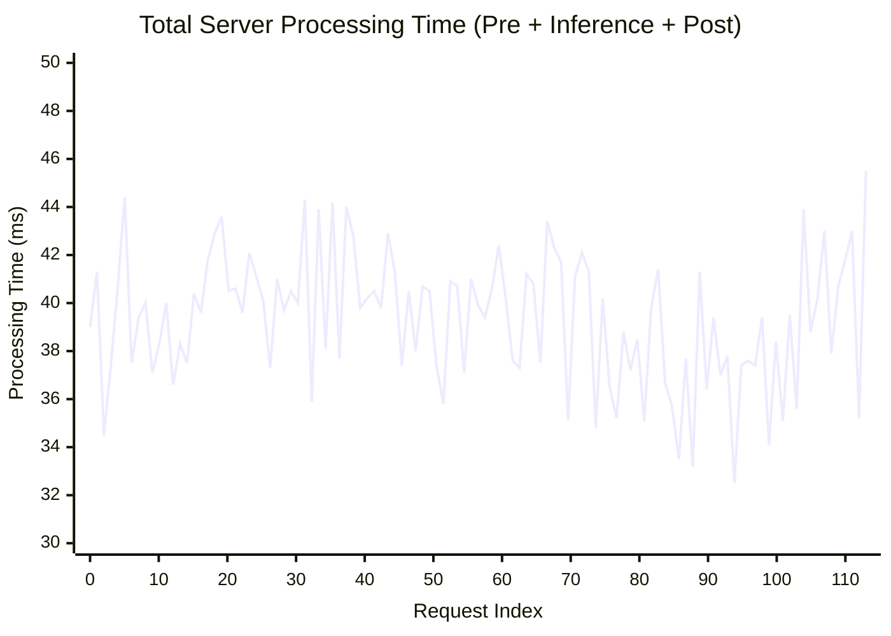
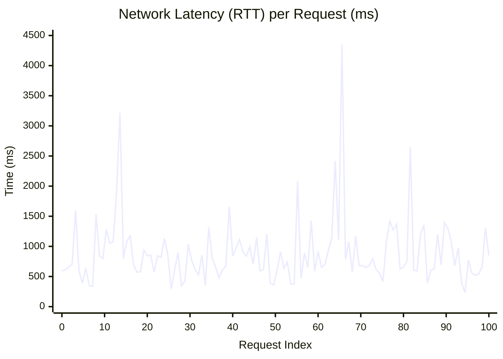
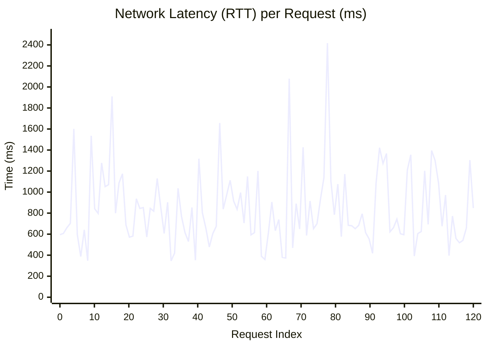
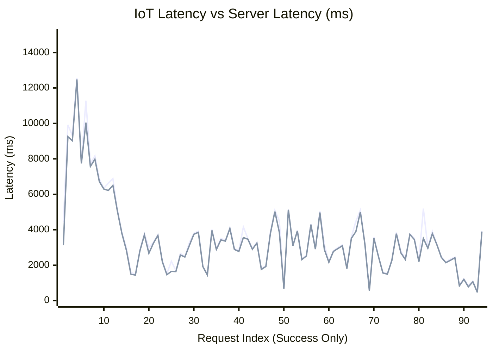
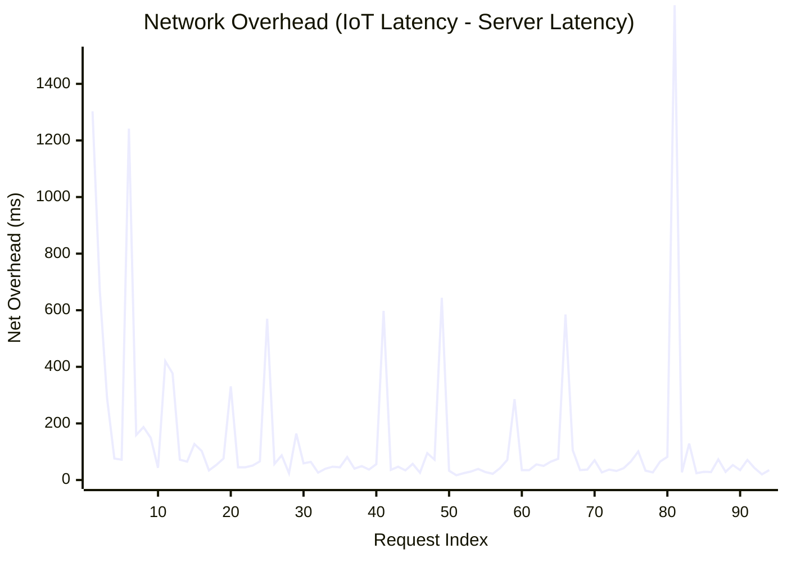
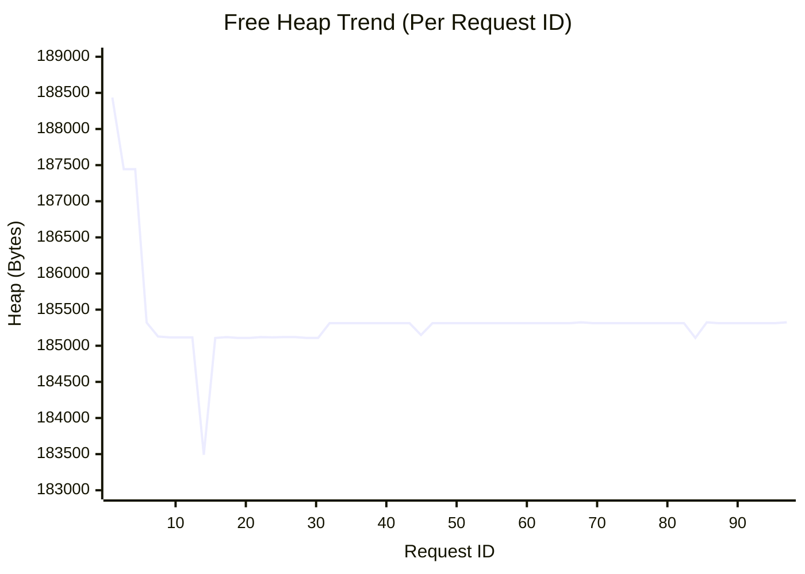

# Latency optimization

## Baseline Latency Analysis
### [ESP: Baseline measurements](../results.md#baseline-latency-logs-esp)

- if the server is not step, the standard timeout for a network request is around 5 seconds, which conforms the default timeout setting:

```
18:56:57.784 > [HTTP] Error: connection refused
18:56:57.784 > ---- Network Message Timings ----
18:56:57.801 > Payload Created At: 130391 ms
18:56:57.805 > Network Send Time After Payload Creation: 1 ms
18:56:57.806 > Network Receive Time - After Send: 5002 ms
18:56:57.810 > Command End Time - After Receive: 0 ms
18:56:57.815 > Total Time from Payload Creation to Command End: 5003 ms
```

- the baseline lantency for a successful request when the server is idle is around 500 - 1450 ms, but we can see 

```
20:04:00.583 > [HTTP] Raw Commands: NONE
20:04:00.583 > ---- Network Message Timings ----
20:04:00.587 > Payload Created At: 311561 ms
20:04:00.589 > Network Send Time After Payload Creation: 1 ms
20:04:00.596 > Network Receive Time - After Send: 1364 ms
20:04:00.597 > Command End Time - After Receive: 102 ms
20:04:00.601 > Total Time from Payload Creation to Command End: 1467 ms
```


here is the graph of latency over time:



and here is the histogram of latency distribution:


Analyzing the data, we have the following statistics:

| Metric         | Value               |
| -------------- | ------------------- |
| Minimum        | 156 ms              |
| Maximum        | 5054 ms             |
| Average (Mean) | 790 ms              |
| Median         | ~622 ms             |
| Mode           | 465 ms, 574 ms      |

- the maximum latency of 5054ms is an outlier, so that indicates a case **when the connection time out/packet loss happens**
- the average latency is **right-skewed** by the outliers, so median is a better representation of typical latency
- The high standard deviation of 680ms indicates extreme jitter, suggesting that there might be either network instability or instable request overhead.
- the minimum latency of 156ms **indicates my system actually functions correctly, and can achieve low latency**, confirming that the current bottlenecks are architectural rather than physical.

### Remove the Outliers

To better analyze the typical latency, we can remove the max 3 data and min 3 data points as outliers:



The trimmed data shows:

- Min: 226
- Max: 2374
- Mean: 725.68
- Median: 625
- Standard Deviation: 385.50

### [Backend: Baseline measurements](../results.md#baseline-latency-logs-server)
the typical server processing time is around 40ms:

```
0: 480x640 1 person, 37.5ms
Speed: 1.2ms preprocess, 37.5ms inference, 0.4ms postprocess per image at shape (1, 3, 480, 640)
Results saved to ......
Detection Results: Found 1 objects
[IoT] Processed Image from ESP32_Cam_01, Detections: 1
INFO:     192.168.0.171:63600 - "POST /api/devices/... HTTP/1.1" 200 OK
```

here is the graph of server processing time over time:



the server processing time is relatively stable, with an average of 39.5ms and a standard deviation of 2.8ms, indicating that the server is not the main source of latency variability.

## Optimizations - `Keep Alive` & `HTTP Persistent Connections`

When I analysize the latency breakdown logs:

```
INFO:     192.xxx.x.xxx:55282 - "POST /api/devices/file/image HTTP/1.1" 200 OK
INFO:     192.xxx.x.xxx:55283 - "POST /api/devices/file/image HTTP/1.1" 200 OK
INFO:     192.xxx.x.xxx:55284 - "POST /api/devices/file/image HTTP/1.1" 200 OK
...
```

In my origial implementation, each HTTP request opens a new TCP connection, send the request, and then close the connection. This TCP connection setup and teardown may introduce significant overhead.

therefore, I only setup the http request once, and reuse the same connection for subsequent requests. Here is what I got:



The "optimized" latency data shows:

- Mean: 893.14 ms
- Max: 4351 ms
- Min: 235 ms
- Median: 755.5 ms
- Standard Deviation (SD): 547.71 ms

which is even worse than before...

After removing the top 3 and bottom 3 outliers, we have:



The trimmed "optimized" latency data shows:

- Mean: 845.46 ms
- Max: 2417 ms
- Min: 346 ms
- Median: 755.5 ms
- Standard Deviation (SD): 364.93 ms

so where is the problem? I look back at the server logs, and found this:

```
INFO:     192.xxx.xxx.xxx:63912 - "POST /api/devices/file/image HTTP/1.1" 200 OK
INFO:     127.0.0.1:56071 - "GET /livereload/118715765/118716218 HTTP/1.1" 404 Not Found
INFO:     127.0.0.1:56071 - "GET /livereload/118715765/118716218 HTTP/1.1" 404 Not Found
...
INFO:     192.xxx.xxx.xxx:63912 - "POST /api/devices/file/image HTTP/1.1" 200 OK
INFO:     127.0.0.1:56071 - "GET /livereload/118715765/118716218 HTTP/1.1" 404 Not Found
```

This indicates there might be other unwanted background traffic on the server, interfering with the processing of my requests.

## Optimizations - Asynchronous Server Task flow

In addition, the current flow completes everything sequentially. So the server will first receive the entire image, process it, and then send back the response. This means the device has to wait for the entire processing to complete before it can proceed.

Therefore, I modified the server to handle the image processing asynchronously and return the response quicker

```python
def receive_image(...):
    raw_bytes = await request.body()
    ...
    background_tasks.add_task(background_image_processing, raw_bytes, x_device_id)
    pending_commands = await get_and_clear_commands(x_device_id)
    ...
    return formatted_pending_commands
```

## Measure Latency After Optimizations - HD Image

in the real scenario, the image is at least HD (1280x720) resolution, so I also measured the latency with HD images

here is the graph of latency measure on the ESP32 (which is the total latency) and on the server (which is only the server processing time):



Here is the difference between the IoT latency and the server latency (which is the network + overhead):




# Memory optimization

### Measure heap usage

in fact, the baseline and the optimized heap usage are similar. I did not measure the baseline heap usage, but here is the final heap usage after all optimizations:



The heap usage remains relatively stable throughout the requests, with minor fluctuations likely due to GC activity or temporary allocations. The free heap ranges from approximately 183,492 bytes to 188,436 bytes, indicating that there is no significant memory leak or excessive memory consumption during operation.

---